# Analysis of the Economic Impact of University Students on the Local Economy

## 🚀 Project Overview
This project presents a structured analysis of the economic impact generated by university students on the local economy of Tunja. By transforming raw survey data into actionable strategic insights, this repository serves as a decision-making tool for educational institutions, local government, and the commercial sector.

## 🎯 Objectives
* **Impact Quantification:** Analyze spending patterns and identify key economic opportunities.
* **Strategic Segmentation:** Understand residency profiles and their relationship with monthly budgets.
* **Decision Support:** Bridge the gap between data and action with professional visuals and "Decision" insights.

## 🛠️ Technologies Used
* **Python 3.x**
* **Pandas:** Data manipulation and cleaning.
* **Matplotlib & Seaborn:** Professional-grade strategic visualizations.
* **Jupyter Notebook:** Interactive analytical environment.

## 📊 Key Highlights
- **Robust Parsing:** Custom budget parser to handle complex range formats (e.g., "1,000,000+").
- **Strategic Visualization:** Charts specifically designed for stakeholders (Chambers of Commerce, Universities).
20: - **Professional Reorganization:** Structured into 6 phases: Introduction, Dataset, Cleaning, Strategic Analysis, Insights, and Conclusions.
21: 
22: ## 📊 Data Visualizations
23: 
24: | Chart | Chart |
25: | :---: | :---: |
26: | 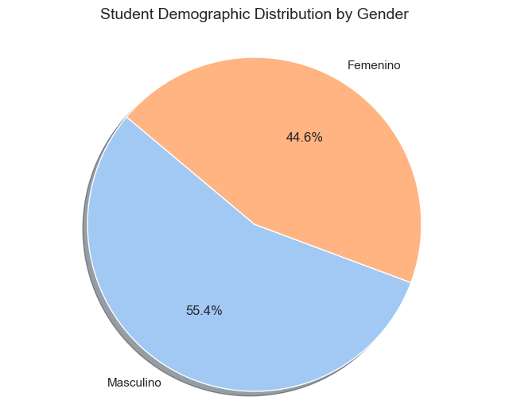 | 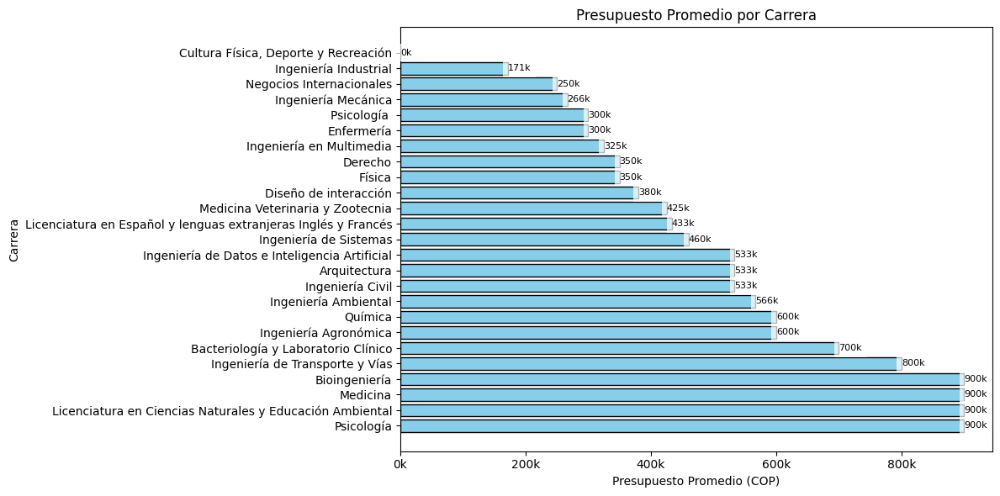 |
27: | 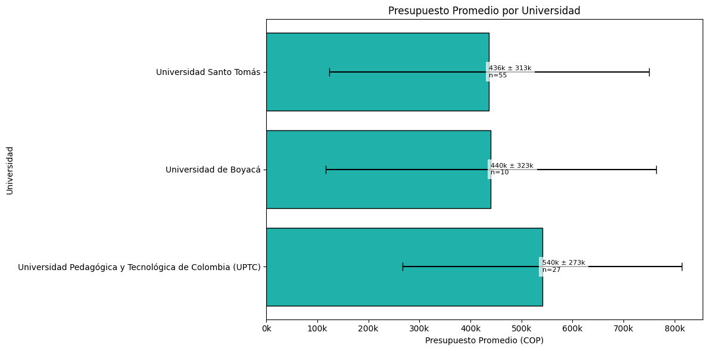 | 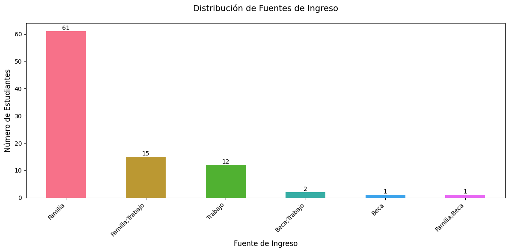 |
28: | 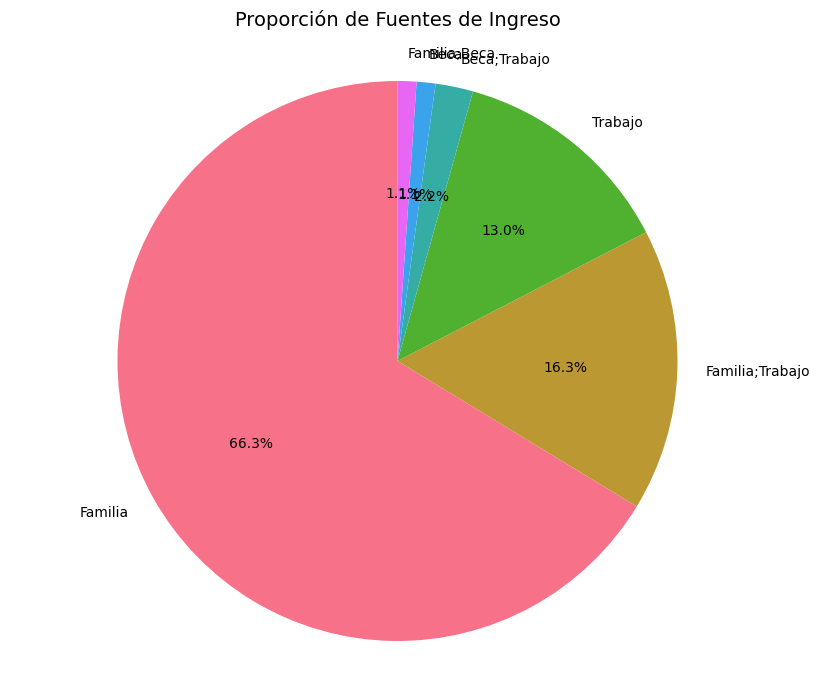 | 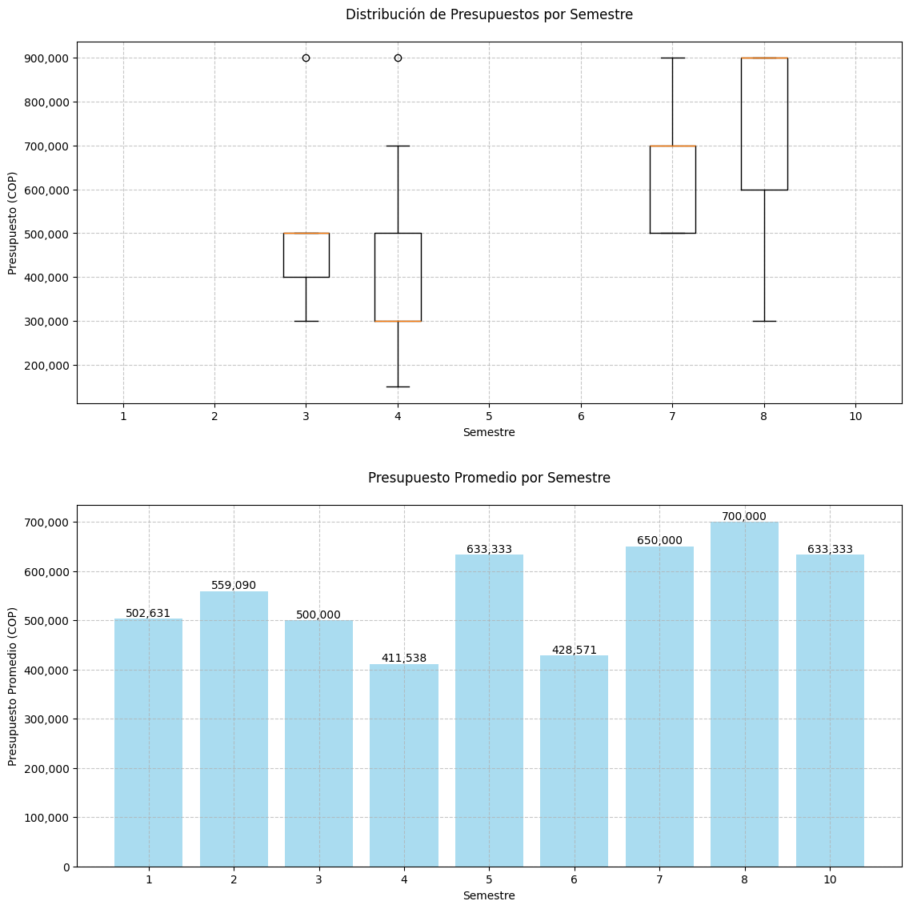 |
29: | 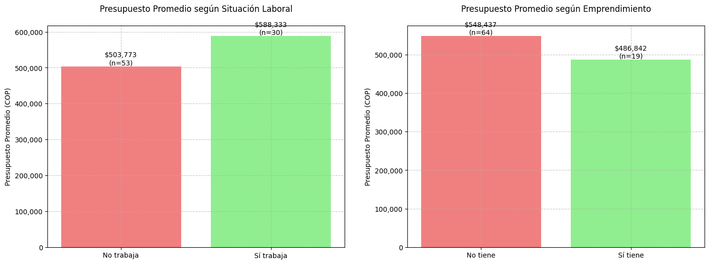 | 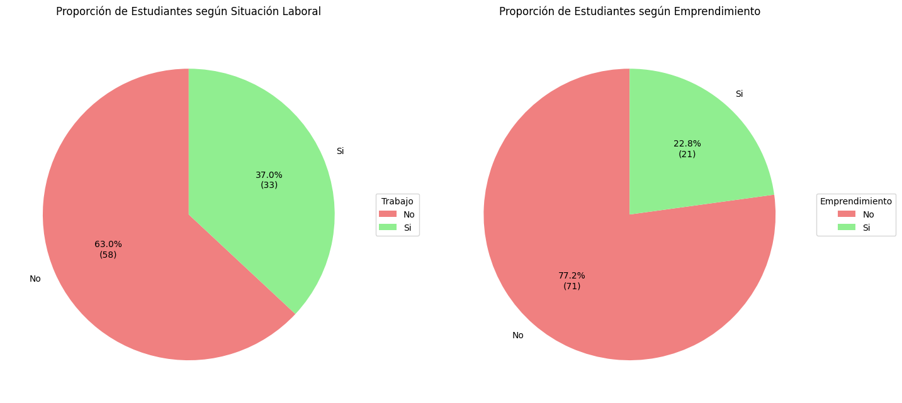 |
30: | 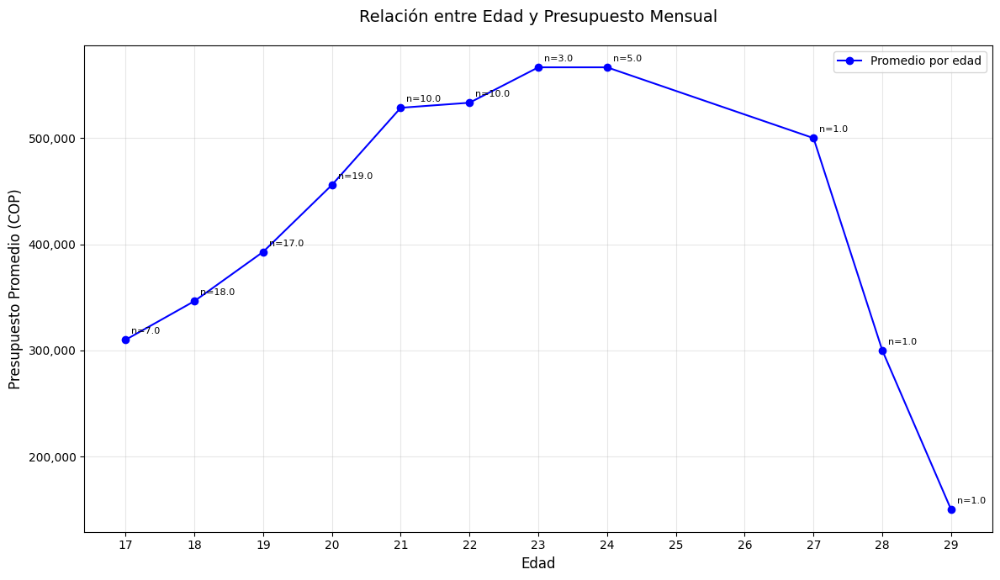 | 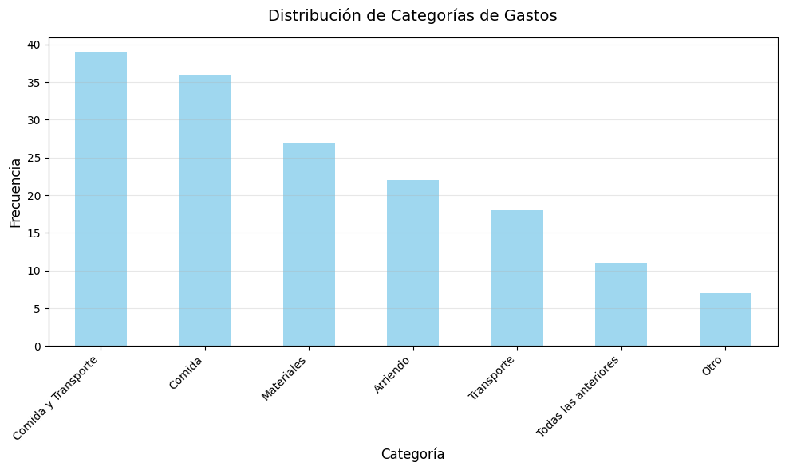 |
31: | 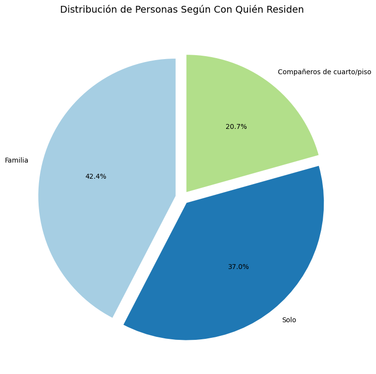 | 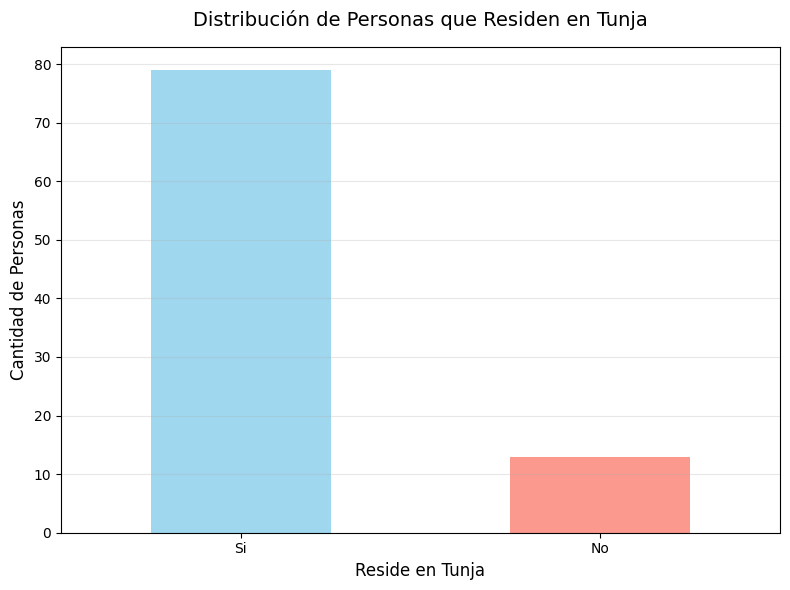 |
32: | 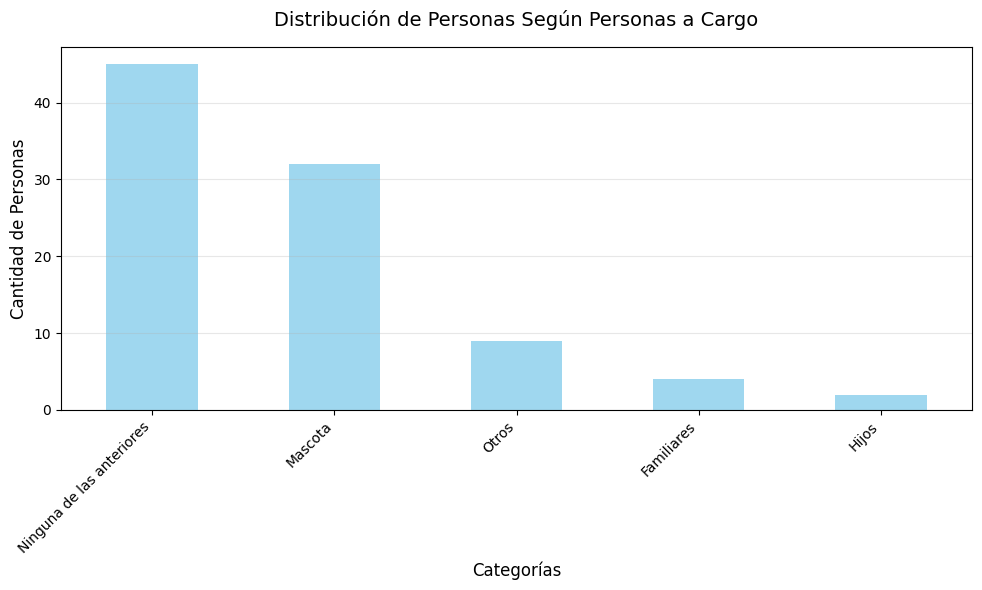 | 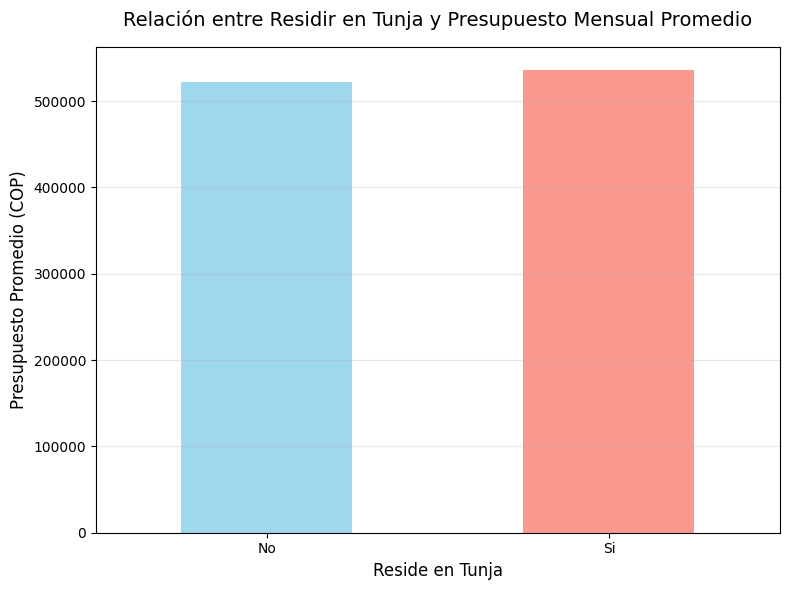 |
33: | 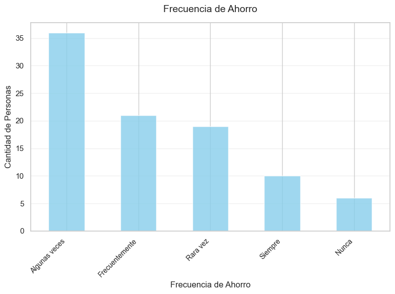 |  |
34: 
35: ## 📂 Repository Structure
```text
├── ProyectoImpactoEconomico.ipynb  # Primary Analysis Notebook
├── Impacto economico.csv           # Raw dataset
├── Impacto economico_clean.csv     # Final processed dataset
└── README.md                       # Project documentation
```

## 📈 Strategic Insights
The analysis revealed that students residing away from home contribute **significantly more** to the local food and service economy. This data suggests a major opportunity for local businesses to develop student-loyalty programs and for institutions to optimize housing subsidies.

---
**Author:** [M4NUERU](https://github.com/M4NUERU)
**Project Status:** Initial English Version - Fully Debugged & Localized.
